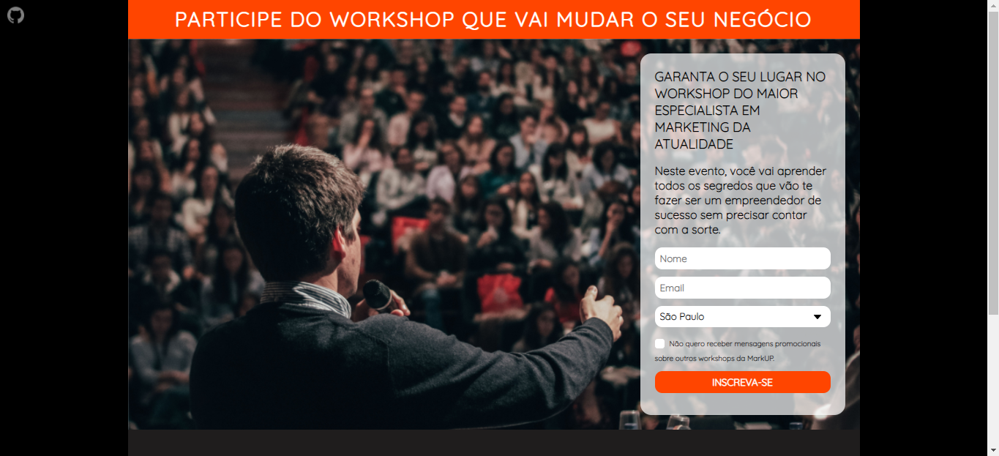

# Landing page project with HTML and CSS

## [SITE HERE](https://isabdch.github.io/landing-page-project-html-css/)

## 📖 Table of Contents

- [Project Description](#project-description)
- [Status](#status)

## ✏️ Project Description

This is my first landing page project using HTML and CSS with forms. This is about a workshop on marketing.

- ### HTML

  To create basic HTML content, buttons, forms, etc.

- ### CSS

  To stylize the HTML elements.

## ⏱️ Status

This project is finished.

---

Made with 💜 by Isabelle Brandão 👋 [See my LinkedIn](https://www.linkedin.com/in/isabelle-brand%C3%A3o-5645551a8/)
